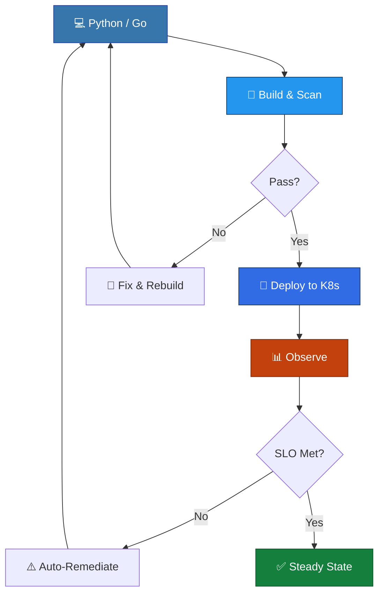

<div align="center">

  

  <a href="https://git.io/typing-svg">
    
  </a>

  <br/>
  
  
  

</div>

---

## 🧠 About Me

<table>
<tr>
<td width="55%">

```yaml
name:        Anjali Priya
role:        DevSecOps & Infrastructure Engineer
location:    Bengaluru, India
mission:     Design resilient, secure, and automated infrastructure

experience:
  - Infrastructure automation on OpenShift with Terraform & Golang
  - CI/CD pipeline optimization across Tekton, Jenkins & Harness
  - Building CIS & NIST-compliant VM & container images (Image Bakery)
  - Policy enforcement with Sentinel for governance & risk management
  - SDDC-to-AWS migration, Terraform Enterprise on AKS
  - SCA & vulnerability scanning — Trivy, Blackduck, Aquasec, Veracode
  - Observability with Dynatrace + Splunk for centralized log analysis
  - Terraform Plugin Framework & core IaC component contributions

open_source:
  - Building tools that solve real infrastructure problems
  - Active contributor to DevSecOps & platform engineering projects
  - Open to collaborating on cloud-native tooling and automation
```

</td>
<td width="45%" align="center">

<br/>
<p align="center">
  
  &nbsp;
  
  &nbsp;
  
  &nbsp;
  
  &nbsp;
  
  &nbsp;
  
</p>



</td>
</tr>
</table>

---

## 💼 Professional Experience

<table>
<tr>
<td align="center" width="50%">

### 🏦 State Street &nbsp; `Jun 2022 – Jul 2025`
*Senior Associate — Platform Engineering*

```
┌──────────────────────────────────────────┐
│  React (Control Plane)                   │
│        ↕                                │
│  Node.js (Managed Infrastructure)       │
│        ↕                                │
│  Terraform ▪ Ansible ▪ AWS ▪ Azure      │
│        ↕                                │
│  CIS/NIST-Compliant VM & Container Images│
└──────────────────────────────────────────┘
```

`React` `Node.js` `Terraform` `Ansible` `AWS` `Azure` `Sentinel`

Built a **managed infrastructure platform** that standardized provisioning across the enterprise — React-powered control plane with a Node.js backend orchestrating infrastructure. Developed CIS & NIST-compliant golden images, enforced governance via Sentinel policies, and migrated SDDC workloads to AWS.

</td>
<td align="center" width="50%">

### 🔵 IBM &nbsp; `Jul 2025 – Present`
*Software Engineer — Z/OS Platform*

```
┌──────────────────────────────────────────┐
│  Terraform Plugin Framework              │
│        ↕                                │
│  OpenShift ▪ Tekton ▪ Kubernetes        │
│        ↕                                │
│  Golang ▪ SCA ▪ Container Scanning      │
└──────────────────────────────────────────┘
```

`Golang` `Terraform` `OpenShift` `Tekton` `Kubernetes` `Docker`

Contributing to the **Terraform Plugin Framework** and core IaC components. Streamlining infrastructure provisioning on Red Hat OpenShift with Golang-based automation, optimizing CI/CD pipelines across Tekton and Kubernetes, and embedding DevSecOps practices into the module development lifecycle.

</td>
</tr>
</table>

---

## 📜 Certifications

<p>
  
  
</p>

---

## 📈 GitHub Stats

<div align="center">
  <a href="https://github.com/anjalipriyaa">
    
    
  </a>
</div>

---

## 📂 Projects

<table>
<tr>
<td align="center" width="50%">

### 🐳 [DockComply](https://github.com/AnjaliPriyaa/DockComply)
*Self-hosted compliance-as-a-service for Docker images*

```
┌─────────────────────────────────────┐
│  FastAPI ──► Redis Queue ──► Go     │
│  (API)        (Jobs)         (Scan) │
│                                     │
│  Docker-in-Docker ▪ K8s (GKE)      │
│  Async processing ▪ Live status    │
└─────────────────────────────────────┘
```

`Python` `Go` `FastAPI` `Redis` `Docker` `Kubernetes` `GKE`

Automated security & compliance checks for container images — catches misconfigurations before they reach production.

</td>
<td align="center" width="50%">

### 🤖 [Job-Tracker-App](https://github.com/AnjaliPriyaa/Job-Tracker-App)
*AI-powered job monitor with Telegram alerts*

```
┌─────────────────────────────────────┐
│  LinkedIn ──► AI Match ──► Alerts   │
│  (Scrape)     (Gemini)    (Telegram)│
│                                     │
│  LangChain ▪ Cron every 20 min     │
│  Dedup engine ▪ GitHub Actions      │
└─────────────────────────────────────┘
```

`Python` `LangChain` `Gemini` `Telegram API` `GitHub Actions`

Monitors job portals for DevOps/Infrastructure roles in Bengaluru, matches via LLM, and notifies instantly.

</td>
</tr>
<tr>
<td align="center" width="50%">

### 🧠 [AI-Chat-Studio](https://github.com/AnjaliPriyaa/AI-Chat-Studio)
*LLM applications from first principles*

`Python` `OpenRouter` `OpenAI SDK` `Prompt Engineering` `RAG` `Multi-Agent`

A hands-on journey building LLM apps from scratch — chat, tool calling, embeddings, vector DBs, and agents — with the goal of reaching production-ready AI systems.

</td>
<td align="center" width="50%">

### 🔬 [Cell_Game](https://github.com/AnjaliPriyaa/Cell_Game)
*Conway's Game of Life in React*

`React` `JavaScript` `Docker` `GitHub Actions`

Interactive cellular automaton simulation with Docker containerization and CI/CD pipeline.

</td>
</tr>
</table>

---

## 🛠️ Tech Arsenal

### 🐍 Python &nbsp; 🔵 Go &nbsp; 🟨 JavaScript

<table>
<tr>
<td width="33%">

#### 🐍 Python
| Area | Stack |
|------|-------|
| Cloud SDKs | `boto3`, `aws-cdk`, `azure-sdk` |
| Web & APIs | `fastapi`, `flask`, `pydantic` |
| AI / LLMs | `langchain`, `openai`, `google-generativeai` |
| CLI Tools | `click`, `typer`, `rich` |
| IaC Testing | `pytest`, `moto`, `testinfra` |

</td>
<td width="33%">

#### 🔵 Go
| Area | Stack |
|------|-------|
| IaC & Plugins | `terraform-plugin-sdk`, `terraform-plugin-framework` |
| K8s & Controllers | `controller-runtime`, `client-go` |
| CLI & DevOps | `cobra`, `viper`, `go-flags` |
| APIs & Services | `net/http`, `goroutines`, `gin` |

</td>
<td width="33%">

#### 🟨 JavaScript
| Area | Stack |
|------|-------|
| Frontend | `react`, `node.js` |
| Build & CI | `docker`, `github-actions` |

</td>
</tr>
</table>

---

### ⚙️ Infrastructure as Code & Config Management
<p>
  
  
  
  
</p>

### 🐳 Containers, Orchestration & Pipelines
<p>
  
  
  
  
  
</p>

### 🚀 CI/CD & GitOps
<p>
  
  
  
  
  
</p>

### 🔐 Security, Compliance & Scanning
<p>
  
  
  
  
  
</p>

### ☁️ Cloud & Platforms
<p>
  
  
  
  
</p>

### 📊 Observability & Monitoring
<p>
  
  
  
</p>

---

## ✍️ From My Keyboard

<p>
  <a href="https://medium.com/@anjalipriya_">
    
  </a>
  &nbsp; — DevSecOps patterns, IaC deep-dives, and infrastructure stories
</p>

> *"Infrastructure is code. Security is a feature, not a checklist. Observability is not optional."*

---

## 🤝 Let's Connect

<div align="center">

  <a href="https://www.linkedin.com/in/anjalipriya24/">
    
  </a>
  <a href="https://medium.com/@anjalipriya_">
    
  </a>
  <a href="mailto:anji707951@gmail.com">
    
  </a>

  <br/><br/>
  <i>Open to collaborating on infrastructure automation, open source tooling, and cloud-native projects.</i>

</div>

---

<div align="center">
  
</div>
