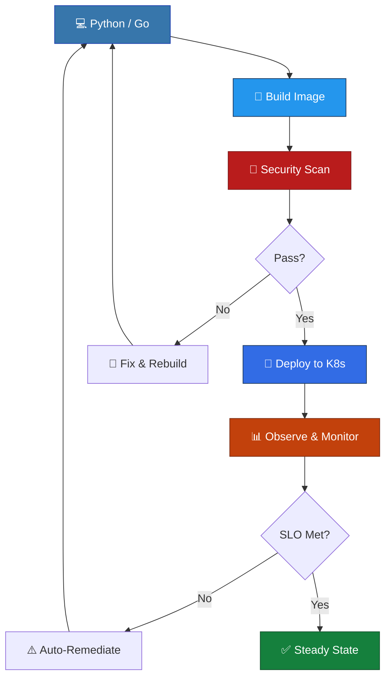

<div align="center">

  

  <a href="https://git.io/typing-svg">
    
  </a>

  <br/>
  
  
  

</div>

<br/>

---

## 🧠 About Me

<table>
<tr>
<td width="55%">

```yaml
role:       DevSecOps & Infrastructure Engineer
location:   Cloud-Native Ecosystem
mission:    Design resilient, secure, automated infrastructure

domains:
  ☁️ infrastructure:
      Terraform (multi-cloud), Ansible, Packer
      Pulumi, Crossplane, Helm, Kustomize
  🐳 containers:
      Docker, Kubernetes, OpenShift
      Istio, Envoy, containerd
  🚀 pipelines:
      Jenkins, GitHub Actions, Harness
      ArgoCD, Flux, progressive delivery
  📊 observability:
      Grafana LGTM, Dynatrace, Splunk
      Prometheus, OpenTelemetry, PagerDuty
  🔒 security:
      Vault, OPA, Sentinel, Trivy
      CIS/STIG hardening, cert-manager
  🐍 languages:
      Python: boto3, fastapi, flask, lambda
      Go: controllers, CLI tools, high-perf agents
      Bash: the glue that holds it all together
```

</td>
<td width="45%" align="center">

<br/>

<p align="center">
  
  &nbsp;
  
  &nbsp;
  
  &nbsp;
  
  &nbsp;
  
</p>

<br/>



</td>
</tr>
</table>

---

## 📈 GitHub Stats

<div align="center">
  <a href="https://github.com/anjalipriyaa">
    
    
  </a>
</div>

---

## 🛠️ Tech Arsenal

### ⚙️ Infrastructure as Code & Provisioning
<p>
  
  
  
  
  
  
</p>

### 🐳 Containers, Orchestration & Service Mesh
<p>
  
  
  
  
  
  
</p>

### 🚀 CI/CD, GitOps & Progressive Delivery
<p>
  
  
  
  
  
</p>

### 🔐 Security, Secrets & Compliance
<p>
  
  
  
  
  
  
</p>

### ☁️ Cloud Platforms
<p>
  
  
  
  
  
</p>

### 📊 Observability & Monitoring
<p>
  
  
  
  
  
  
</p>

### 🐍 Python & 🔵 Go — What I Build

<table>
<tr>
<td width="50%">

#### 🐍 Python
| Use Case | Libraries & Tools |
|----------|------------------|
| AWS Automation | `boto3`, `aws-lambda`, `aws-cdk` |
| Infra APIs & Webhooks | `fastapi`, `flask`, `pydantic` |
| CLI Tools | `click`, `typer`, `rich` |
| IaC Testing | `pytest`, `moto`, `testinfra` |
| K8s Automation | `kubernetes-client`, `kopf` |

</td>
<td width="50%">

#### 🔵 Go
| Use Case | Libraries & Tools |
|----------|------------------|
| K8s Controllers | `controller-runtime`, `client-go` |
| High-Perf Agents | `goroutine` pools, `net/http` |
| DevOps CLI | `cobra`, `viper`, `go-flags` |
| Terraform Providers | `terraform-plugin-sdk` |
| Observability | `opentelemetry-go`, `promhttp` |

</td>
</tr>
</table>

---

## 🏗️ Infrastructure Patterns

<div align="center">

```
 ┌──────────────────────────────────────────────────────────────┐
 │            🏛️  MULTI-CLOUD LANDING ZONE                      │
 │                                                              │
 │   ┌───────────┐    ┌───────────┐    ┌───────────┐           │
 │   │  AWS VPC  │    │ Azure VNet│    │ On-Prem DC│           │
 │   │  ┌─────┐  │    │  ┌─────┐  │    │  ┌─────┐  │           │
 │   │  │ EKS │  │    │  │ AKS │  │    │  │ OCP │  │           │
 │   │  └─────┘  │    │  └─────┘  │    │  └─────┘  │           │
 │   └─────┬─────┘    └─────┬─────┘    └─────┬─────┘           │
 │         └────────────────┼───────────────┘                  │
 │                   ┌───────┴───────┐                         │
 │                   │  Transit GW   │                         │
 │                   └───────┬───────┘                         │
 │         ┌─────────────────┼─────────────────┐               │
 │   ┌─────┴─────┐    ┌──────┴──────┐    ┌─────┴─────┐        │
 │   │  GitOps   │    │  CI/CD Hub  │    │  Secrets  │        │
 │   │ (ArgoCD)  │    │  (Harness)  │    │  (Vault)  │        │
 │   └───────────┘    └─────────────┘    └───────────┘        │
 └──────────────────────────────────────────────────────────────┘
```

</div>

<div align="center">

| 🔄 Pattern | 🏷️ What It Solves | 🛠️ Tools |
|-----------|-------------------|---------|
| **GitOps** | Single source of truth, auditable rollbacks | ArgoCD, Flux |
| **Immutable Infra** | Zero config drift, reliable rollbacks | Packer, Terraform |
| **Policy-as-Code** | Automated compliance, governance guardrails | OPA, Sentinel, Kyverno |
| **Zero-Trust** | mTLS everywhere, no implicit trust | Istio, Envoy, cert-manager |
| **Progressive Delivery** | Canary, blue-green, reduce blast radius | Argo Rollouts, Flagger |
| **Secretless Workloads** | No static credentials in apps | Vault Agent, IRSA, Workload Identity |

</div>

---

## 📂 Featured Projects

<div align="center">

| 🚀 Project | 📝 Description | 🛠️ Stack |
|-----------|---------------|---------|
| **Terraform Landing Zone** | Multi-account AWS with security guardrails | `Terraform` `OPA` `AWS Organizations` |
| **Golden AMI Pipeline** | CIS-hardened images via Packer + Ansible | `Packer` `Ansible` `GitHub Actions` |
| **K8s Platform Toolkit** | Batteries-included cluster bootstrap | `Helm` `ArgoCD` `Istio` `Vault` |
| **Observability Stack** | Pre-configured LGTM + Dynatrace dashboards | `Grafana` `Loki` `Tempo` `Prometheus` |
| **Python Infra SDK** | Reusable `boto3` wrappers & CLI toolkit | `Python` `Click` `boto3` `pytest` |
| **Go K8s Controller** | Custom operator for internal platform | `Go` `controller-runtime` `client-go` |

</div>

---

## 📝 From My Keyboard

<p>
  <a href="https://medium.com/@anjalipriya_">
    
  </a>
  &nbsp; — DevSecOps patterns, IaC deep-dives, and infrastructure automation stories
</p>

> *"Infrastructure is code. Security is a feature, not a checklist. Observability is not optional."*

---

## 🤝 Let's Connect

<div align="center">

  <a href="https://www.linkedin.com/in/anjalipriya24/">
    
  </a>
  <a href="https://medium.com/@anjalipriya_">
    
  </a>
  <a href="mailto:anji707951@gmail.com">
    
  </a>

  <br/><br/>

  <i>Open to collaborating on infrastructure automation, platform engineering, and DevSecOps tooling.</i>

</div>

---

<div align="center">
  
</div>
